# THIS README IS UNDER ACTIVE EDITING AS THE PROJECT PROGRESSES.

## 1. Project Management

### 1.1 Project Overview:
This is a UCF Data Analytics Bootcamp Final Project. The aim of this project is to develop an accurate and reliable regression model for predicting depression rates in a given FIPS code area utilizing various parameters such as health, employment, economics, education and transportation. 
The reason we chose this topic is because of it's relevance in the post-COVID world. Rates of depression and anxiety have greatly increased as social isolation has followed. Hopefully, this analysis allows us to better pinpoint what drives these mental fitness issues and consequently how to best address them.

### 1.2 Project Breakdown:
The end-to-end build of this project will have 5 steps:
1) We will select our input data for the model.
2) We will clean our raw data in order for it to be effectively stored and used within the model.
3) We will design and build our database to store this data.
4) We will design and build our machine learning model.
5) We will design and build our visualizations to derive key insights from our analysis.

### 1.3 Team and Collaboration:
Our team consists of 5 members: Chris Cornelius, Ryan Neblett, Ali Manekia, Yessika Zurita and Ben Pietrancosta. Our collaboration can be broken down into 2 main components:
 - Communication -> We primarily used Slack and Zoom. We have a group Slack thread over which topics can be discussed and resolved as they arise. However, we also have scheduled post-class, 15 minute meets on Mondays and Wednesdays to review the status of our various tasks.
 - Documentation -> We're using Github and Google Drive to share documentation. The idea is that materials required to make the model work are stored and organized on Github. For example, we have our input data, our pre-processing JPN, our machine-learning model code and so on. 
For all supplemental documentation such as contact information, roles, task assignments and so on, we use Google Drive.

Our responsibilities can be broken down as follows:
 - Chris -> SME in designing and implementing an ML model
 - Ryan -> SME in designing the AWS environment
 - Ali -> ETL specialist
 - Yessika -> Visualization
 - Ben Pietrancosta -> Github manager

### 1.4 Timeline:
We have 3 weeks to complete this project. Each week we will be required to meet pre-defined deliverables. We are expecting to spend upwards of 10 hours a week/each in order to realize the successful implementation of this project.

### 1.5 List of technologies:
Below are a list of technologies we are planning to use for this project:
 - Python & Jupyter Notebook -> To pre-process data and implement the ML model
 - Quick DataBase Diagrams -> To design the ERD
 - AWS -> To host our database
 - PgAdmin -> To run our database
 - Tableau -> For our visualizations
 - Google Drive -> Documentation repository

## 2. Data pre-processing
### 2.1 Data sourcing overview:
To define a database in which there are multiple tables that can be merged into a single meta-table used for a regression analysis, we must have a common primary key across the aforementioned data sets. We decided to use county FIPS ID (Federal Information Processing Standard) as our common column for joins.
Consequently our data is sourced from government websites that host data, examples include the CDC (Center for Disease Control), the Department of Transportation and the US Bureau of Labor Statistics.

### 2.2 Individual data set pre-processing:

 - Health Data Preprocessing -> Source: https://chronicdata.cdc.gov/500-Cities-Places/PLACES-Local-Data-for-Better-Health-County-Data-20/swc5-untb/explore/query/SELECT%0A%20%20%60year%60%2C%0A%20%20%60stateabbr%60%2C%0A%20%20%60statedesc%60%2C%0A%20%20%60locationname%60%2C%0A%20%20%60datasource%60%2C%0A%20%20%60category%60%2C%0A%20%20%60measure%60%2C%0A%20%20%60data_value_unit%60%2C%0A%20%20%60data_value_type%60%2C%0A%20%20%60data_value%60%2C%0A%20%20%60data_value_footnote_symbol%60%2C%0A%20%20%60data_value_footnote%60%2C%0A%20%20%60low_confidence_limit%60%2C%0A%20%20%60high_confidence_limit%60%2C%0A%20%20%60totalpopulation%60%2C%0A%20%20%60locationid%60%2C%0A%20%20%60categoryid%60%2C%0A%20%20%60measureid%60%2C%0A%20%20%60datavaluetypeid%60%2C%0A%20%20%60short_question_text%60%2C%0A%20%20%60geolocation%60%2C%0A%20%20%60%3A%40computed_region_bxsw_vy29%60%2C%0A%20%20%60%3A%40computed_region_he4y_prf8%60%0AORDER%20BY%20%60statedesc%60%20DESC%20NULL%20LAST/page/filter.
This data provides various health statistics at a FIPS (county) level and is hosted by the Centers for Disease Control and Prevention.  The table includes data for both 2019 and 2020 and has additional information about the various health measures and FIPS geolocation in the table. The preprocessing work focused primarily on breaking the complex table down into several smaller tables that align with the standards of a relational database (minimize duplicative data across tables, establish singular primary keys, etc.) some of the data was also removed.  
The group chose to focus on 2020 for the project and removed 2019 data entirely. In addition, the metrics included both raw numbers and age-adjusted numbers. The group intends to use average age and other age-related factors in the analysis and elected to eliminate the age-adjusted metrics so as to not skew the results. 
The Base_Data_Preprocessed folder in this Github project includes the Jupyter notebook detailing the preprocessing work, as well as the input and output files generated from it. Note the input file was too large to upload in its raw form and was instead zipped.

 - IRS Refund Data Preprocessing -> Source: https://www.irs.gov/statistics/soi-tax-stats-individual-income-tax-statistics-zip-code-data-soi
 The data provided statistics about tax returns filed with the IRS for calendar year 2020.  The data was aggregated at a ZIP code level, which is more granular than the census bureau’s FIPS-level data from the Health section, so the data was preprocessed using a ZIP-to-FIPS lookup table (source: https://www.huduser.gov/portal/datasets/usps_crosswalk.html).  Note that several of the ZIP codes in the IRS data were dummied out (either 0 or 99999) to indicate unincorporated areas of the US that are sparsely populated.  These were not represented in the health data where the target variable exists and so were dropped.
The IRS_Data_Preprocessed folder in this Github project includes the Jupyter notebook detailing the preprocessing work, as well as the input, output, and lookup files used during that process.  Note the input and output files are too large to reside in Github, even when compressed, and are instead being housed in Google Drive.
Zipped input data: https://drive.google.com/file/d/17HMKhdgRNU5yGKHq19cjoxg6uv_Pf79Z/view?usp=share_link
Zipped output table: https://drive.google.com/file/d/11eJMIpOyufbllNchf0cIOE2lCP3-Chtx/view?usp=share_link

- Transportation Data Preprocessing -> Source: https://data.bts.gov/Research-and-Statistics/County-Transportation-Profiles/qdmf-cxm3. This data set provides information concerning transportation measures per county. It was filtered down to columns which were deemed relevant to depression. Also, there is no confirmed timeframe for this data, but we are operating under the assumption that it also belongs to 2020.
- Employment Data Preprocessing -> Source: https://www.bls.gov/cew/downloadable-data-files.htm. This data set provides a log of the average salary for various job occupations. The data is sorted by FIPS and by NAICS Industy codes. We downloaded the annual singlefile dataset as opposed to quarterly to get as much datapoints in as possible on one table. The table includes over the year changes in income as well as specific location data per industry recording income averages and taxible wages. We determined that for our purposes we only needed the FIPS code, Industry code and average wage columns. These were cleaned and put in a separate csv. A table of the job titles that correspond with their industry code was also generated to be used as as a foreign key for data lookup later.

## 3. Database design and build
### 3.1 Cloud environment:
We'll be hosting the database on an AWS instance.

### 3.2 Database design:
Our database will consist of 6 tables and one reference table. The detail on each has been discussed in the previous section. Below is the schema we produced in Quick DBD. To note, one of the tables contains 100 + columns as it corresponds to line items on tax returns. Therefore, the schema view will be very zoomed out, to view the schema in greater detail you can access the "Database design and build" folder in the root directory which will contain the PNG of the schema which can be zoomed into to greater effect.

## 4. The Models

### Selected Models
Because we are predicting a continuous numerical variable, there are a set of specific machine learning models that we can consider for the project.  They include:

1.	Linear regression – the model is the least resource-intensive but can also overfit or be sensitive to outliers.  We will apply feature selection/feature reduction methods to see if we can improve performance but will consider this as the baseline for the project.
2. Ridge regression - a variation of linear regression that uses L2 regularization to overcome any multicollinearity issues with the data.
2.	LASSO regression – LASSO regression is a variation of regression that reduces the coefficient of some variables to zero, effectively conducting feature selection as part of the regression process.  This might also inform further iterations of linear regression with a smaller data set or revised data to feed into other models.
3.	Random forest regression – this is a variation of the random forest classification model used in the program; instead of predicting a class, the model attempts to predict a specific numeric outcome based on the path traveled through the decision tree.  This might prove useful if the relationship between the target and independent variables is non-linear.

### Target Variable EDA

Prior to attempting the regression, we wanted to understand the distribution of our target variable.  See below histogram and summary table:

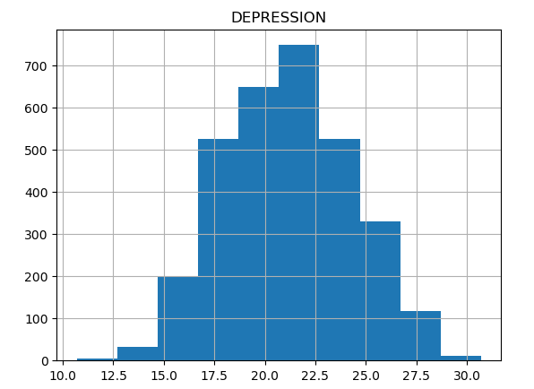

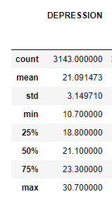

A few key notes:
1.	The target variable will sit between 10 and 30 but appears normally distributed, so we expect most of the training and test data percentages to sit close to 20 percentage points.
2.	RMSE might not be the best indicator of model performance because the range is fairly small and, in the real world, there likely isn’t a huge difference between counties with 20% and 21% depression rates, as an example.  We therefore turn our focus to determining what factors are most likely attributed to depression.

### Regression Data Preprocessing

The individual data sets for health, income, transportation, and industry were joined at the FIPS code/county level and then transformed and modified to prepare for the series of regressions.  Specifically:

1.	There were approximately 2,300 features in the final data frame.  The team manually reviewed each of the data dictionaries for the individual data sets and selected a handful from each that they felt were most likely to impact depression rates.  We were left with 30 independent variables across all four sources.
2.	Regression is sensitive to large differences in relative scale among independent variables.  The data was first split into training and test data (70%/30% respectively).  The transformer was fit on the training data and then both training and test data were transformed with that transformer.
3.	One assumption on the data for regression is that the feature variables are independent of one another and that there is no multicollinearity.  We went through several iterations of calculating the variance inflation factor (VIF) for the set of feature variables and removing those with extremely high values; removing the highest-valued often significantly reduced the VIF values of others.  Eleven features in total were removed.

### OLS Regression

We first used ordinary least squares regression to predict the depression rate of our test data.  Below are the results:

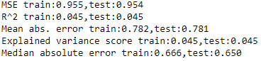

While the mean absolute error of the test data was only 0.78 (meaning less than 1% point difference between predicted and actual depression rate) the R^2 value was only 0.045, implying the data we included in our model only explains about 5% of the variance of depression rates.

### Ridge Regression

Ridge regression is useful when there are likely issues with multicollinearity.  Below is a table of the VIF factors calculated at the end of our iterative feature selection process:

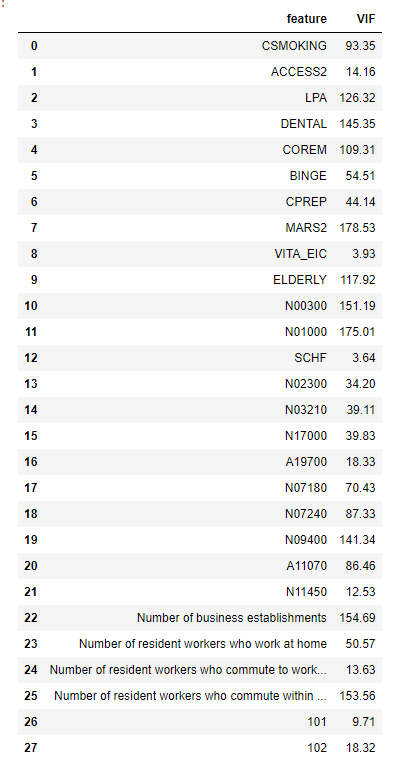

Ideally one would want VIF values below 10; most of the values in the summary table are well above that, indicating multicollinearity is still an issue.  We used ridge regression to compare performance to the OLS baseline, see below results:

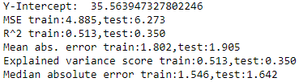

The mean absolute error of the test data was more than double that of the OLS, but the R^2 value increased which implies that a regularized model to deal with multicollinearity shows more of a relationship between the independent and target variables.

### LASSO Regression

LASSO regression is able to both overcome multicollinearity and also performs some feature selection by reducing the coefficients of less relevant independent variables to zero.  Below is the results table:

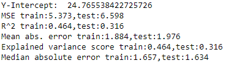

Both the R^2 value and mean absolute error were worse than the ridge regression.  In addition, only two of the coefficients were set to zero, which did not help with reducing the feature space even further:

### Random Forest Regression on Scaled Data

The team did not find with success with using regression on the scaled data set.  One possibility was that, while there was a relationship between the target and feature variables, the relationship was not linear and thus the prior regression models would not perform well.  The team then turned to the random forest regression machine learning model to predict depression rates, as it can handle non-linear relationships.

While random forests can handle unscaled data and a large feature set, we attempted to run the model on the same data set as the regression models and then compare performance.  Below are the results of the model (note that we used grid search to search for the optimal max tree depth and then ran the model using that optimal value):

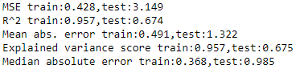

Mean absolute error was higher than OLS but the R^2 value was significantly better than any of the regressions (67% of depression rate variance explained by the set of features we included).

### Random Forest Regression on Unscaled Original Data

Recall that the team used VIF to eliminate 11 features with multicollinearity.  We wanted to know if these removed features added any predictive value to the model.  Because decision trees are not sensitive to multicollinearity, we returned back to the base data set with all 30 features and unscaled numeric values.
Below are the results:

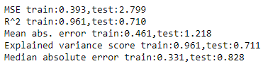

Note that the mean error is still higher than OLS but the R^2 is now increased to 0.71.  We can also look at the most important features in the random forest when it comes to predicting depression rate:

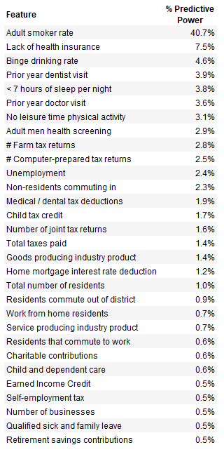

The table tells us that the number of smokers explains 41% of the rate of depression in the county.  The team discussed and felt that the opposite might actually be true: that smoking is a sign of depression and not a cause.  We then removed the smoking variable and retuned/reran the random forest regression to get the following results:

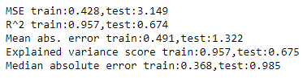

The model did not perform as well as when smoking statistics were included, but if smoking truly is a symptom and not a cause then having it present was causing false results.  And finally, the below table shows the 30 included variables and the percent impact they had on predicting depression rates:

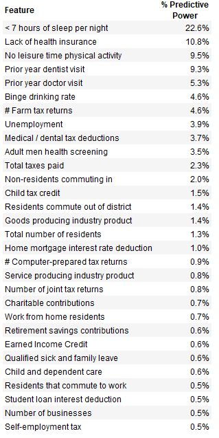

The top five features (lack of sleep, lack of health insurance, no leisure time, and lack of dental/doctor visits) account for more than half of the total predictive power of depression rates.

## 5. Visualization

The visualizations for the project will include:

1.	A series of performance results tables showing comparative accuracy for the various models and their iterations.
2.	An interactive Tableau dashboard that shows the FIPS regions across the US and an information block on hover with the target variable and the data points found to be most impactful on predicting the target variable (when considering the model with the best performance).

The purpose of this second visualization would be for someone to quickly see how prevalent depression is within a given FIPS region and what characteristics of that region (poverty, education) most impact the level of depression.

## Conclusions
